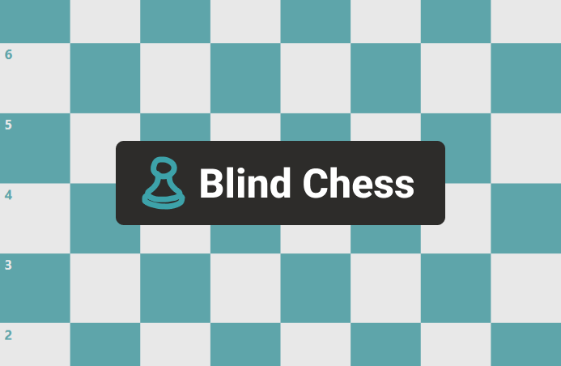

# Blind Chess
<p align="center">
  
</p>

## Table of Contents
* [About](#about)
* [Features](#features)
* [Installation](#installation)
* [How it works](#how-it-works)
* [License](#license)

## About
### Description
A blind chess training website built for honing your board awareness and calculation abilities.
[Try it out](https://mind-chess-kbg6defxyq-uw.a.run.app/)!
### Technologies
* Frontend:
  * Built with [React](https://reactjs.org/)
  * Using the [WebSocket API](https://developer.mozilla.org/en-US/docs/Web/API/WebSockets_API) to communicate with the server during games
* Backend:
  * Built with [Golang](https://go.dev/)
  * Using [Gin](https://github.com/gin-gonic/gin) to route and serve content
  * With [Gorilla WebSocket](https://github.com/gorilla/websocket) for WebSocket communications
  * And [go-redis](https://github.com/go-redis/redis) for interfacing with the Redis database
* Database:
  * Utilizing [Redis](https://redis.io/) for high-performance data synchronization across server instances
* Other:
  * Containerized with [Docker](https://www.docker.com/)

## Features
### Creating and joining game rooms
Play with a friend by creating a room or joining theirs. Rooms identified by five character room codes that are easy to copy and paste or relay over VOIP.
### Customizable time control
With the ability to choose the duration and increment of your game you can turn up the heat with some blitz matches or take your time calculating with some classical or rapid. You can also choose which side you start with if you have a particular opening you want to practice.
### FEN/PGN for post-game analysis
Since all of the moves in your game are stored, after you're done playing you can click a link and access a [Lichess analysis board](https://lichess.org/analysis) of the final position. Load in the PGN of the game too to analyze your game using the [Stockfish](https://stockfishchess.org/) chess engine and see how the tides of the game turned.

## Installation
### Clone the repo
```
git clone github.com/kananb/Blind-Chess.git
```
### Run locally
Before continuing, make sure you have [Docker](https://www.docker.com/get-started) installed.
Replace `${PORT}` with whichever port you want to run the web-service on.
#### Using Redis
```
docker-compose up -f docker-compose.redis.yml --env PORT=${PORT}
```
#### Without Redis (in-memory storage)
```
docker-compose up --env PORT=${PORT}
```

## How it works

## License
[MIT](https://mit-license.org/)

#### [back to the top](#blind-chess)
